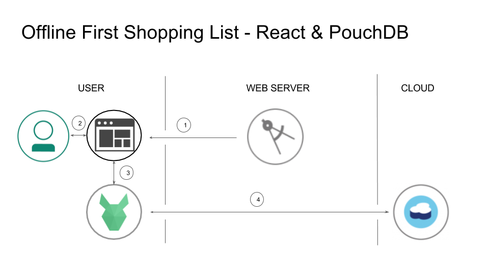

# Create an Offline First Shopping List with React and PouchDB

In this code pattern, we will create an Offline First shopping list. Shopping List is an Offline First demo Progressive Web App built using [React](https://reactjs.org/) and [PouchDB](https://pouchdb.com/). [This app is part of a series of Offline First demo apps, each built using a different stack.](https://github.com/ibm-watson-data-lab/shopping-list).

When the reader has completed this Code Pattern, they will understand how to:

- create a shopping list web application that stores its data in a local PouchDB database.
- turn the web application into a Progressive Web App that works with or without an internet connection.
- make the app sync to and from a remote Cloudant database.

## Flow

1. Browser loads Progressive Web App's resources from the web server
2. User interacts with the web app to add shopping lists and list items
3. Data is stored locally in PouchDB
4. PouchDB syncs its data with a remote IBM Cloudant database

## Included components

* [Cloudant NoSQL DB](https://console.ng.bluemix.net/catalog/services/cloudant-nosql-db): A fully managed data layer designed for modern web and mobile applications that leverages a flexible JSON schema.

## Featured technologies

* [PouchDB](https://pouchdb.com/) - an in-browser database that can replicate to and from a remote Apache CouchDB or IBM Cloudant database.
* [React](https://reactjs.org/) - a JavaScript library for building user interfaces.
* [Material UI](http://www.material-ui.com/) - React components that implement Google's Material Design
* [Apache CouchDB](http://couchdb.apache.org/) - modern, document database hosted on your server or in the cloud.

## Quick Start

To see this app in action without installing anything, simply visit https://ibm-watson-data-lab.github.io/shopping-list-react-pouchdb in a web browser or mobile device.

# License
[Apache 2.0](LICENSE)